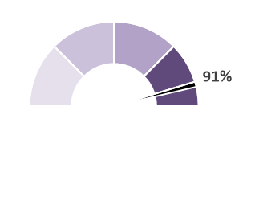
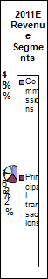

# Pie chart segmentation

Our algorithm consists of three parts. First we perform data analysis and preprocess the dataset using computer vision, cutting out all the unimportant parts, then we apply machine learning to identify key points in the simplified image (the pie chart center and tile boundaries), and finally we use a simple algorithm to convert model outputs to the final percentages.

# Data analysis

After investigating the data, we decided to create a computer vision algorithm to tackle the challenge of cleaning the data and getting it ready for training a model. After previewing a few sets of images from the dataset, we thought we could benefit greatly by being able to separate the actual pie charts from the useless rest of the image data, for example tables and labels.

Hoping to create something stable and interpretable, we turned to computer vision. After common techniques like the Hough circle transform failed us, we chose to pursue creating our own iterative algorithm for circle detection - we first create circles with large tolerance for error all over the image, keep the most promising ones, create copies of them with less tolerance, and repeat multiple times until we converge to a stable point. To score the quality of a circle, we observe how much it overlaps with image edges, hoping to find ones where they align along the entire circumference - this metric is extremely valuable as it allows us to judge how much we have converged. If we find the largest matching circle inside an image, we can be nearly certain that this is the pie chart, similarly, we can realize when we have ended up with an unsatisfactory solution. A preview of our algorithm is as follows:

By adding a fail check and running a slower and more robust version of the same method again when we fail already allows us to correctly identify more than 95% of the pie charts with accuracy being within a few pixels, but we still have problems with exploding pie charts, charts where half is missing, and charts covering only half a circle, like the two below:

Cases like these can be simply observed by monitoring the images on which our previous algorithm fails - and here, we make a similar observation, mainly that we are interested in areas surrounded by a long circular arc. Hence we create another fallback variant to our previous algorithm - if there are no circles found in the image, we search for arcs. This has enabled us to detect the outer edges of all the aforementioned types of plot charts:

We use this technique to preprocess the entire dataset, replacing all pixels outside of the pie charts with black ones, before we proceed to model training. In the end, the only images we have problems segmenting are the ones with extremely small charts, plus ocasionally with ones containing a huge amount of text.

## Network architecture and training
Similarly to ChartOCR, we use a CNN to segment center point and arc points, and then extract percentages from these. We first encode the sector information into a ground truth map $y_{binary} \in R^{3\times H\times W} \in \{0, 1\}$, with the three channels representing background, center, and arc pixels respectively. Like CornerNet, we soften the map around center and arc pixels using a 5 by 5 Gaussian kernel, such that $y = y_{binary}\exp(-\frac{\delta x^2 + \delta y^2}{2})$, where $\delta x$ and $\delta y$ represent the distance to the pixel. 

We split our 10000 image training dataset into 8000 images used for training and 2000 images used for validation.

The neural network consists of:
1. **Encoder** extracting features of different spatial resolutions, pre-trained on ImageNet.
2. **Decoder** decoding these features.
3. (optional) **CenterPool** layer, implemented by recompiling the C++ implementation from the (CenterNet paper)[] in modern PyTorch.
4. **Segmentation head** consisting of a single Convolutional Layer.

We then perform a simple hyperparameter search among the following parameters:
1. Encoder - ResNet34, ResNet50, SegFormerB1, SegFormerB5,
2. Encoder freezing - True, False,
3. Loss function - focal loss, cross-entropy,
4. Decoder architecture - UNet, UNetPlusPlus,
5. CenterPool - included, not included.

Interestingly, the encoder architecture had very limited influence on performance. The SegFormerB5 with 81M parameters did not show any signs of overfitting even when it was not frozen, and performance was almost identical to the much smaller SegFormerB1 or ResNet34. In the end, our best architecture as evaluated on F1 score (~0.89) over the validation dataset was:
1. Encoder - ResNet34,
2. Encoder freezing - False,
3. Loss function - cross-entropy,
4. Decoder architecture - UNet,
5. CenterPool - included.

We then train it over the entire 10000 image preprocessed training dataset before submission.

Additionally, we train an object detection network that outputs bounding boxes around the piecharts. We use a FasterRCNN ResNet34 architecture that we fine-tune on the PieChart data. We use this network to filter out unfeasible found points and to give suggestions for center points if the segmentation network does not output any. This approach leads to a ~0.01 improvement in the final Kaggle score.

## Percentage generation algorithm

In this section, we will describe how we transform the output of our model into the percentages required for evaluation. As described previously, our model outputs a 3-element probability distribution for each pixel - 1 layer for the background, another one for the pie chart center, and finally one for the segment boundary ends.

We start by identifying the center - we take the 2D image the model outputs and remove all points above a certain threshold. We consider their positions in the 2D space and average their positions - this will give us our estimate of the pie chart center. We continue by finding key points on the pie chart outer edge - we take the texture from our model, once again keep all points above a threshold. After that we apply a simplified version of the non-max suppression operation, merging all points that are close enough to one another.

When we have the point and the center, we simply start with a zero angle at the top of the circle. We continue clockwise, and if at any time we find a boundary keypoint, we save the angle. Afterwards we assign the percentages to be directy proportional to the angle distances between consecutive points. If for whatever reason our model fails to assign a percentage to a pie chart, leaving it empty or with one element only, we assign the percentage to one hundred.
