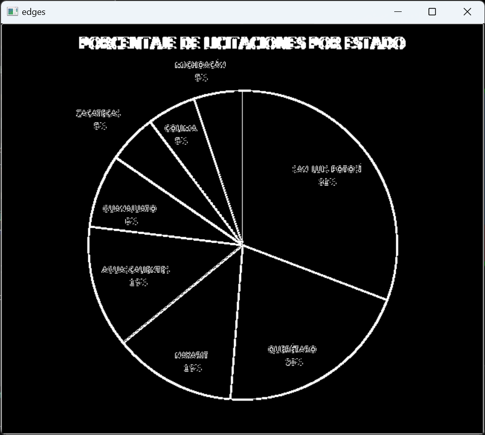
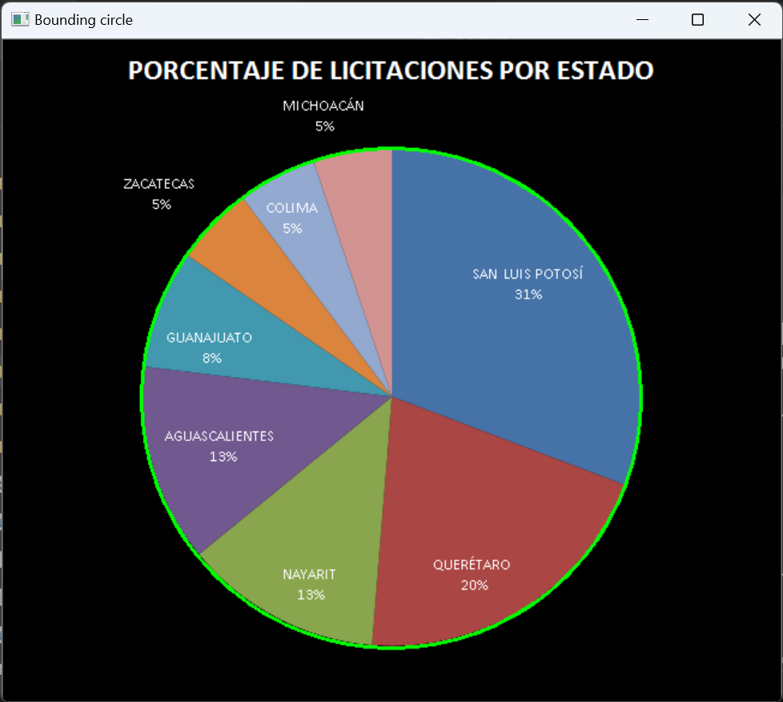
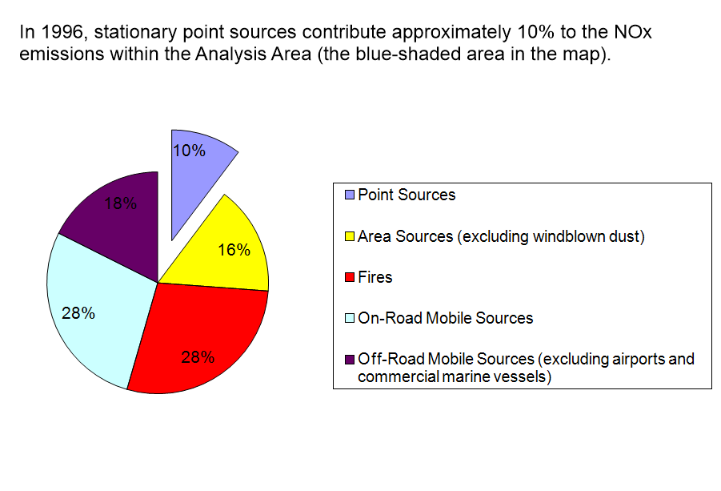
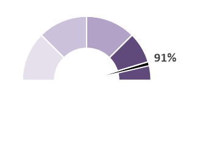
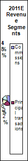

# Data analysis

After investigating the data, we decided to create a computer vision algorithm to tackle the challenge of cleaning the data and getting it ready for training a model. After previewing a few sets of images from the dataset, we thought we could benefit greatly by being able to separate the actual pie charts from the useless rest of the image data, for example tables and labels.

Hoping to create something stable and interpretable, we turned to computer vision. After common techniques like the Hough circle transform failed us, we chose to pursue creating our own iterative algorithm for circle detection - we first create circles with large tolerance for error all over the image, keep the most promising ones, create copies of them with less tolerance, and repeat multiple times until we converge to a stable point. To score the quality of a circle, we observe how much it overlaps with image edges, hoping to find ones where they align along the entire circumference - this metric is extremely valuable as it allows us to judge how much we have converged. If we find the largest matching circle inside an image, we can be nearly certain that this is the pie chart, similarly, we can realize when we have ended up with an unsatisfactory solution. A preview of our algorithm is the following:

By adding a fail check and running a slower and more robust version of the same method again when we fail already allows us to correctly identify more than 95% of the pie charts with accuracy being within a few pixels, but we still have problems with exploding pie charts, charts where half is missing, and charts covering only half a circle, like the two below:

Cases like these can be simply observed by monitoring the images on which our previous algorithm fails - and here, we make a similar observation, mainly that we are interested in areas surrounded by a long circular arc. Hence we create another fallback variant to our previous algorithm - if there are no circles found in the image, we search for arcs. This has enabled us to detect the outer edges of all the aforementioned types of plot charts:

We use this technique to preprocess the entire dataset, replacing all pixels outside of the pie charts with black ones, before we proceed to model training. In the end, the only images we have problems segmenting are the ones with extremely small charts, plus ocasionally with ones containing a huge amount of text.

